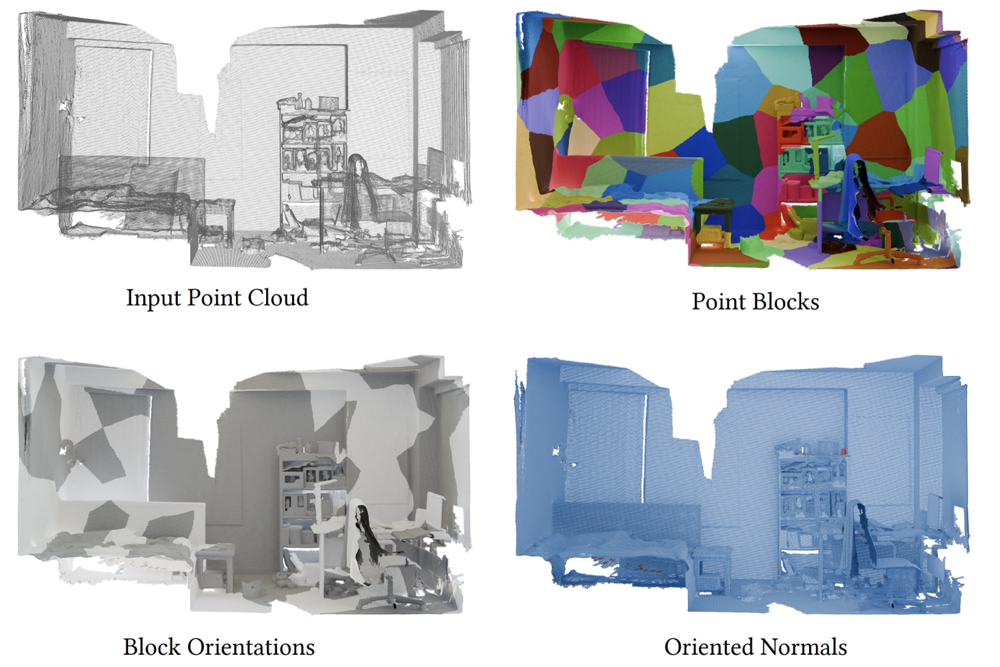

I'm a M.S. student in Computer Graphics at the [University of Chinese Academy of Sciences](https://www.ucas.ac.cn/). My research interests include computer graphics, point cloud processing, mesh processing, and geometric modeling.

I am very fortunate to be advised by [Prof. Fei Hou](https://lcs.ios.ac.cn/~houf/index.html) from the Institute of Software, Chinese Academy of Sciences.

I received my B.S. degree in Digital Media Technology from [Shandong University](https://www.sdu.edu.cn/) in 2023. Currently, I'm working on various projects related to point cloud orientation, neural-based methods for geometric processing, and mesh analysis.

My recent work focuses on developing efficient algorithms for scene-level point cloud processing, particularly in the area of normal orientation for non-watertight point clouds. I have published research in top-tier graphics venues including ACM Transactions on Graphics.

## Publications

  

    
  

  

    <h3 style="color: #D2691E; margin-top: 0; margin-bottom: 8px; font-size: 18px;">A Divide-and-Conquer Approach for Global Orientation of Non-Watertight Scene-Level Point Clouds Using 0-1 Integer Optimization</h3>
    
<strong>Zhuodong Li</strong>, Fei Hou, Wencheng Wang, Xuequan Lu, Ying He

    
ACM Transactions on Graphics 2025

    

      <a href="https://doi.org/10.1145/3730923" style="margin-right: 10px;">[Paper]</a>
      <a href="https://arxiv.org/abs/2505.23469" style="margin-right: 10px;">[arXiv]</a>
      <a href="https://github.com/zd-lee/DACPO" style="margin-right: 10px;">[Code]</a>
    

  

You can find my CV here: [Zhuodong Li's Curriculum Vitae](../assets/autoCV.pdf).

[Email](mailto:lizd@ios.ac.cn) / [Github](https://github.com/crazyMessi)