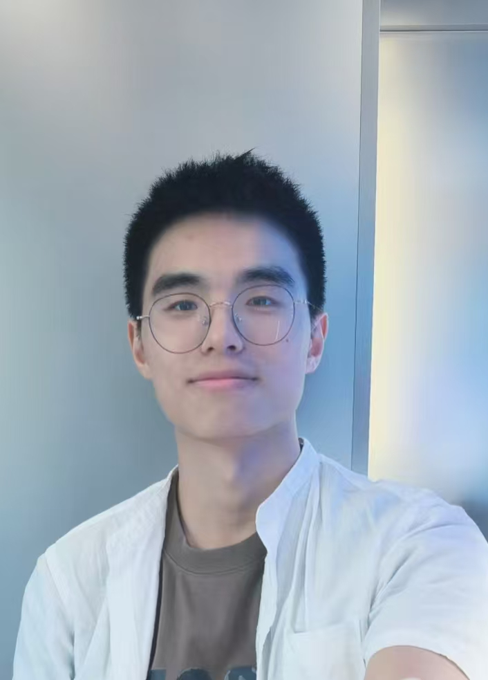

I'm a M.S. student in Computer Graphics at the [University of Chinese Academy of Sciences](https://www.ucas.ac.cn/). My research interests include computer graphics, point cloud processing, mesh processing, and geometric modeling.

I am very fortunate to be advised by [Prof. Fei Hou](https://lcs.ios.ac.cn/~houf/index.html) from the Institute of Software, Chinese Academy of Sciences.

I received my B.S. degree in Digital Media Technology from [Shandong University](https://www.sdu.edu.cn/) in 2023. Currently, I'm working on various projects related to point cloud orientation, neural-based methods for geometric processing, and mesh analysis.

My recent work focuses on developing efficient algorithms for scene-level point cloud processing, particularly in the area of normal orientation for non-watertight point clouds. I have published research in top-tier graphics venues including ACM Transactions on Graphics.

You can find my CV here: [Zhuodong Li's Curriculum Vitae](../assets/autoCV.pdf).

[Email](mailto:lizd@ios.ac.cn) / [Github](https://github.com/crazyMessi)